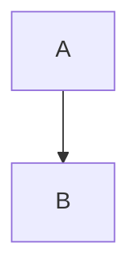

<!---
Fri 01 Jul 2022 01:44:28 PM UTC
Portfolio Website - m0ham3d.com
--->

<a href="https://twitter.com/m0ham3dxx" target="_blank">

<a href="./infogfx/QEE.jpg" target="_blank">
<i> Illustration of Quantum Entanglement - also referred to as "Spooky Action at a distance". Click me for an illustrative explanation. </i> 
</a>

</a>

----
# 🤌 TOC
- [🤌 TOC](#-toc)
- [ℹ️ REPO DESCRIPTION](#ℹ️-repo-description)
- [🎓LEARNING RESOURCES OF QC](#learning-resources-of-qc)
- [🎛️ FUNDAMENTAL PRINCIPLES OF QC](#️-fundamental-principles-of-qc)
  - [Definition of `Quantum`](#definition-of-quantum)
  - [Quantum Physics](#quantum-physics)
  - [Atomic Structure](#atomic-structure)
  - [Quantum Particles](#quantum-particles)
  - [Quantum Mechanics](#quantum-mechanics)
- [🔎 REFERENCES](#-references)
- [📒 GLOSSARY](#-glossary)

----
# ℹ️ REPO DESCRIPTION
This repository has been made after my personal interest in Quantum Computing and it rapid development into an easily accessible form. This list will not be exhaustive and will perpetually be a WIP. I cannot guarantee that it will be free form errors. But the actual content will be referenced.

# 🎓LEARNING RESOURCES OF QC

These are going to links to resources which have a simplified explanation of QC, which are not math heavy. With a greater focus on videos rather than papers. 

# 🎛️ FUNDAMENTAL PRINCIPLES OF QC

These prinicples will be all in illustratins and diagramatic form. These diagrams will be either native github `mermaid` diagrams or external sources 

## Definition of `Quantum`

## Quantum Physics 

## Atomic Structure 

The following diagram is an illustration of the [Stanard Model](https://simple.wikipedia.org/wiki/Standard_Model) of elementary particles.

## Quantum Particles

## [Quantum Mechanics](https://www.livescience.com/33816-quantum-mechanics-explanation.html) 

Defined as a sub field of physics that describes interaction between particles of the sub atomic realm. *Sub Atomic* referring to the particles that form the atoms, and those particles that form the atoms.

# 🔎 REFERENCES 

1. [Header Quantum Entanglement Gif](https://tenor.com/view/entanglement-quantum-entanglement-science-atoms-gif-17770432) - Actual source of image is not described. The illustration is factual as described [HERE.](https://www.livescience.com/what-is-quantum-entanglement.html)

# 📒 GLOSSARY 

n | Term | Expansion
|:--|:--:|:--|
1 | QC | Quantum Computing 