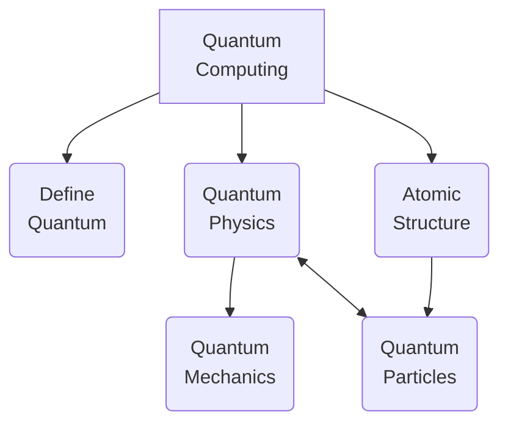
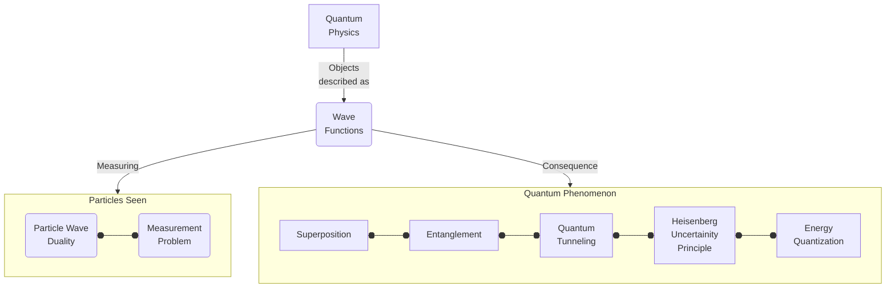
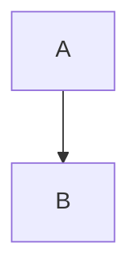

<!---
Fri 01 Jul 2022 01:44:28 PM UTC
Portfolio Website - m0ham3d.com
--->

<a href="https://twitter.com/m0ham3dxx" target="_blank">

</a>

<a href="https://twitter.com/m0ham3dxx" target="_blank">

<a href="./infogfx/QEE.jpg" target="_blank">
<i> Illustration of Quantum Entanglement - also referred to as "Spooky Action at a distance". Click me for an illustrative explanation. </i> 
</a>

</a>

----
# 🤌 TOC
- [🤌 TOC](#-toc)
- [ℹ️ REPO DESCRIPTION](#ℹ️-repo-description)
- [🎓LEARNING RESOURCES OF QC](#learning-resources-of-qc)
- [🎛️ FUNDAMENTAL PRINCIPLES OF QC](#️-fundamental-principles-of-qc)
  - [Definition of `Quantum`](#definition-of-quantum)
  - [Quantum Physics](#quantum-physics)
  - [Atomic Structure](#atomic-structure)
  - [Quantum Particles](#quantum-particles)
  - [Quantum Mechanics](#quantum-mechanics)
- [🔎 REFERENCES](#-references)
- [📒 GLOSSARY](#-glossary)

----
# ℹ️ REPO DESCRIPTION
This repository has been made after my personal interest in Quantum Computing and it rapid development into an easily accessible form. This list will not be exhaustive and will perpetually be a WIP. I cannot guarantee that it will be free form errors. But the actual content will be referenced. 

The scientific concepts mentioned in this repository are simplified definitions, and do not cover the breath of theoretical knowledge that defines its existence. It is left to the reader to further explore these areas. I have ensured to included **hyperlinks** in such situations.

The goal of the scientfic concepts is to build a foundation in undertanding the origins or *QC*.

I have also added *🍌TLDR* block to each section, for fast understanding.

# 🎓LEARNING RESOURCES OF QC

These are going to links to resources which have a simplified explanation of QC, which are not math heavy. With a greater focus on videos rather than papers. Note all of these sources have been studied for the content in this repository.

N | Source | Url | Synopsis
|:--|:--:|:--:|:--:|
1 | ▶️Youtube | ▶️[Quantum Physics made simple - Wave-Particle Duality Animation](https://youtu.be/Xmq_FJd1oUQ) |  Animation describing the dual behavior of a particle as both a wave and a particle
2 | ▶️Youtube | ▶️[Physics - Chapt. 66 Quantum Mechanics (1 of 9) What Is Quantum Mechanics?](https://youtu.be/j-HdVUTemO0) | - Physics lecture on understanding *Quantum Mechanics*, thisi branch exists because standard laws of physics are modified at a subatomic level
3 | ▶️Youtube | ▶️[Quantum Computers, Explained With Quantum Physics](https://youtu.be/jHoEjvuPoB8) |  Understanding quantum computing in light of quantum physics concepts. *Qubits* the fundamenetal processing unit of QC
4 | 📷Slides | 📷[Quantum Physics Infographics](https://slidesgo.com/theme/quantum-physics-infographics) | Simplified understanding of QP by comparison to the macro world

> 🍌 TLDR - Above media is more entertaining than reading the following text

# 🎛️ FUNDAMENTAL PRINCIPLES OF QC

To understand QC we have first to have understand important concepts of quantum physics. The *knowlege tree* looks like the following - 

These prinicples will be all in illustratins and diagramatic form. These diagrams will be either native github `mermaid` diagrams or external sources 

## Definition of `Quantum`

Quantum(*Singular*) or Quanta(*Plural*) [defined](http://physicsbuzz.physicscentral.com/2018/02/just-what-is-quantum.html) as the smallest and simplest unit of something. In the case of Quantum Mechanics / Quantum Physics, it refers to a [sub atomic particle](https://www.livescience.com/mystery-of-proton-neutron-behavior-in-nucleus.html), such as [electrons (e-), protons (p+), neutrons (n0)](https://www.livescience.com/65427-fundamental-elementary-particles.html). 

> 🍌 TLDR - Quantum means the smallest and simplest unit of thing

## Quantum Physics 

<i>Current lanscape of understanding of physics</i>

## Atomic Structure 

The following diagram is an illustration of the [Standard Model](https://simple.wikipedia.org/wiki/Standard_Model) of elementary particles as described by the [particle theory in physics.](https://www.le.ac.uk/se/centres/sci/selfstudy/particle01.html)

> 🍌 Every thing can be broken own into smaller units. The most commonly known unit is the *molecule*. *molecules* in turn are made of smaller particles, and so and so forth until we reach the limits of observation.

## Quantum Particles

## [Quantum Mechanics](https://www.livescience.com/33816-quantum-mechanics-explanation.html) 

Defined as a sub field of physics that describes interaction between particles of the sub atomic realm. *Sub Atomic* referring to the particles that form the atoms, and those particles that form the atoms.

# 🔎 REFERENCES 

1. [Header Quantum Entanglement Gif](https://tenor.com/view/entanglement-quantum-entanglement-science-atoms-gif-17770432) - Actual source of image is not described. The illustration is factual as described [HERE.](https://www.livescience.com/what-is-quantum-entanglement.html)

# 📒 GLOSSARY 

n | Term | Expansion
|:--|:--:|:--|
1 | QC | Quantum Computing 
2 | QP | Quantum Physics 
3 | QP | Quantum Mechanics