<!---
Fri 01 Jul 2022 01:44:28 PM UTC
Portfolio Website - m0ham3d.com
--->

<a href="https://twitter.com/m0ham3dxx" target="_blank">

</a>

<a href="https://twitter.com/m0ham3dxx" target="_blank">
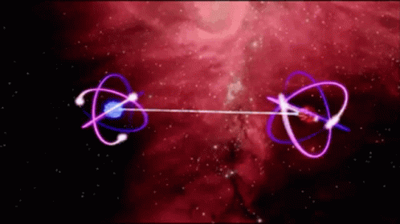

<a href="./infogfx/QEE.jpg" target="_blank">
<i> Illustration of Quantum Entanglement - also referred to as "Spooky Action at a distance". Click me for an illustrative explanation. </i> 
</a>

</a>

----
# 🤌 TOC
- [🤌 TOC](#-toc)
- [ℹ️ REPO DESCRIPTION](#ℹ️-repo-description)
- [🎓LEARNING RESOURCES OF QC](#learning-resources-of-qc)
- [🎛️ FUNDAMENTAL PRINCIPLES OF QC](#️-fundamental-principles-of-qc)
  - [Definition of `Quantum`](#definition-of-quantum)
  - [Quantum Physics](#quantum-physics)
    - [**Particle Wave Duality**](#particle-wave-duality)
    - [**Measurement Problem**](#measurement-problem)
    - [**Superposition**](#superposition)
    - [**Quantum State**](#quantum-state)
    - [**👻Entanglement** (also referred to as Spooky Action)](#entanglement-also-referred-to-as-spooky-action)
    - [**Quantum Tunneling**](#quantum-tunneling)
    - [**Heisenberg Uncertainity Principle**](#heisenberg-uncertainity-principle)
    - [**Energy Quantization**](#energy-quantization)
  - [Standard Model of Particle Physics](#standard-model-of-particle-physics)
  - [Quantum Particles](#quantum-particles)
  - [Quantum Mechanics](#quantum-mechanics)
    - [Wave Functions](#wave-functions)
- [🐱‍💻 Quantum Computing (Finally 🙃)](#-quantum-computing-finally-)
- [🔎 References](#-references)
- [📒 GLOSSARY](#-glossary)

----
# ℹ️ REPO DESCRIPTION
This repository has been made after my personal interest in Quantum Computing. The infommation will not be exhaustive and will perpetually be a WIP. I cannot guarantee that it will be free form errors. But the actual content will be referenced. 

The scientific concepts mentioned in this repository are an ovesimplification for fast understanding with no deep mathematical proofs, and does not cover the breath of the theoretical knowledge that defines its existence. It is left to the reader to further explore these areas. I have ensured to included **hyperlinks** in such situations.

The goal of the scientfic concepts is to build a foundation in undertanding the origins or *QC*.

I have also added *🍌TLDR* block to each section, for fast understanding.

# 🎓LEARNING RESOURCES OF QC

These are going to links to resources which have a simplified explanation of QC, which are not math heavy. With a greater focus on videos rather than papers. Note all of these sources have been studied for the content in this repository.

N | Source | Url | Synopsis
|:--|:--:|:--:|:--:|
1 | ▶️Youtube | [▶️ Quantum Physics made simple - Wave-Particle Duality Animation](https://youtu.be/Xmq_FJd1oUQ) |  Animation describing the dual behavior of a particle as both a wave and a particle
2 | ▶️Youtube | [▶️ Physics - Chapt. 66 Quantum Mechanics (1 of 9) What Is Quantum Mechanics?](https://youtu.be/j-HdVUTemO0) | - Physics lecture on understanding *Quantum Mechanics*, thisi branch exists because standard laws of physics are modified at a subatomic level
3 | ▶️Youtube | [▶️ Quantum Computers, Explained With Quantum Physics](https://youtu.be/jHoEjvuPoB8) |  Understanding quantum computing in light of quantum physics concepts. *Qubits* the fundamenetal processing unit of QC
4 | 📷Slides | [📷 Quantum Physics Infographics](https://slidesgo.com/theme/quantum-physics-infographics) | Simplified understanding of QP by comparison to the macro world
5 | ▶️Youtube | [▶️ If You Don't Understand Quantum Physics, Try This!](https://youtu.be/Usu9xZfabPM) | Source video for *Fig 3: Components of QP*
6 | ▶️Youtube | [▶️ quantum superposition of states and decoherence](https://youtu.be/7B1llCxVdkE) | Animation superposition of quantum states of an electron and decoherence (time taken for the superposition to disappear)
7 | 📃Paper | [📃 Quantum States & Superposition](https://www.southampton.ac.uk/~doug/quantum_physics/superposition.pdf) | Mathematical discussion of Quantum States & Superposition
8 | ▶️Youtube | [▶️quantum tunnel effect and tunneling microscope](https://youtu.be/K64Tv2mK5h4) | Animation quanutm teunneling effect, ie., quantum particles can pass through objects
9 | ▶️Youtube | [▶️ Quantum Tunneling](https://youtu.be/RF7dDt3tVmI) | Animation style explanation of a wave functions
10 | ▶️Youtube | [▶️Breaking The Heisenberg Uncertainty Principle](https://youtu.be/uZDhCW-PTRM) | Short documentary on the uncertainity principle
11 | 📰Article | [📰 What Is Planck's Constant, and Why Does the Universe Depend on It?](https://science.howstuffworks.com/dictionary/physics-terms/plancks-constant.htm) | Article discussing the origins and applications of the planc's constant in modern media
12 | ▶️Youtube | [▶️Eigenvalues and eigenstates in quantum mechanics](https://youtu.be/p1zg-c1nvwQ) | Discussion of mathematical operators that enable physical observables in quantum mechanics
13 | ▶️Youtube | [▶️Quantum Entanglement: Spooky Action at a Distance](https://youtu.be/JFozGfxmi8A) | Explanation of Quantum Entanglement from [FermiLab](https://www.fnal.gov/) 
14 | ▶️Youtube | [▶️The Most Successful Scientific Theory Ever: The Standard Model](https://youtu.be/Unl1jXFnzgo) | Description of the standard model of particle physics - which are the fundamental building blocks of everything in the universe

> 🍌 TLDR - Above media is more entertaining than reading the following text

# 🎛️ FUNDAMENTAL PRINCIPLES OF QC

To understand QC we have first to have understand important concepts of quantum physics. The *knowlege tree* looks like the following - 

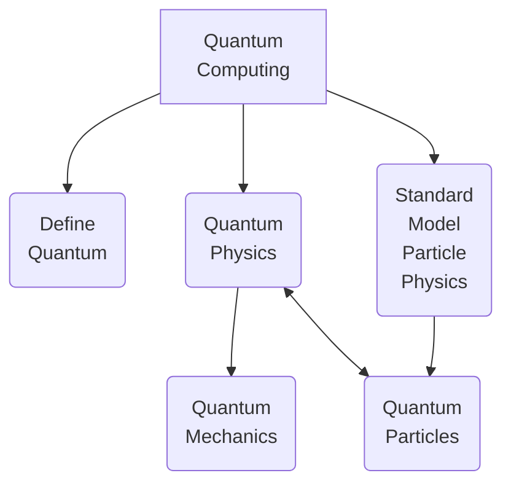

<i>Fig1: QC knowledge tree</i>

 

## Definition of `Quantum`

Quantum(*Singular*) or Quanta(*Plural*) [defined](http://physicsbuzz.physicscentral.com/2018/02/just-what-is-quantum.html) as the smallest and simplest unit of something. In the case of Quantum Mechanics / Quantum Physics, it refers to a [sub atomic particle](https://www.livescience.com/mystery-of-proton-neutron-behavior-in-nucleus.html), such as [electrons (e-), protons (p+), neutrons (n0)](https://www.livescience.com/65427-fundamental-elementary-particles.html). 

> 🍌 TLDR - Quantum means the smallest and simplest unit of thing

## Quantum Physics 

[Quantum physics](https://scienceexchange.caltech.edu/topics/quantum-science-explained/quantum-physics) is the study of matter and energy at the most fundamental level. It aims to uncover the properties and behaviors of the very building blocks of nature.

<i>Fig 2: Current landscape of understanding of physics</i>

Fig 2 - Illustrates the evolution of our understanding of physics. Until more recent times due to the advancement of experimental technologies, *Quantum Theories* are only now being observed & proved. Please note that their are active efforts of utilizing the Quantum Phenomenon for computing purposes, but our general understanding of it is quite poor

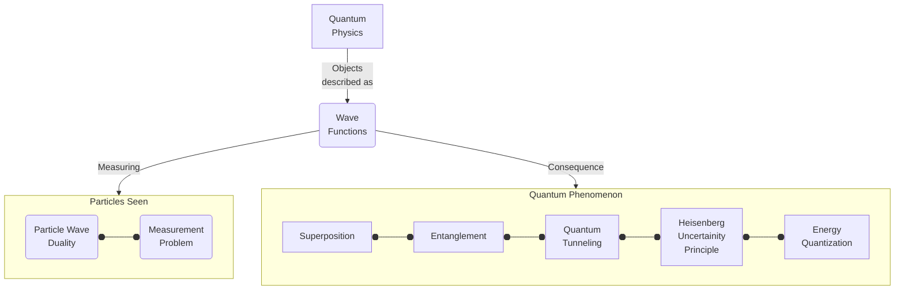

<i>Fig 3: Components of QP</i>

### [**Particle Wave Duality**](https://physicsworld.com/a/wave-particle-duality-quantified-for-the-first-time/) 
[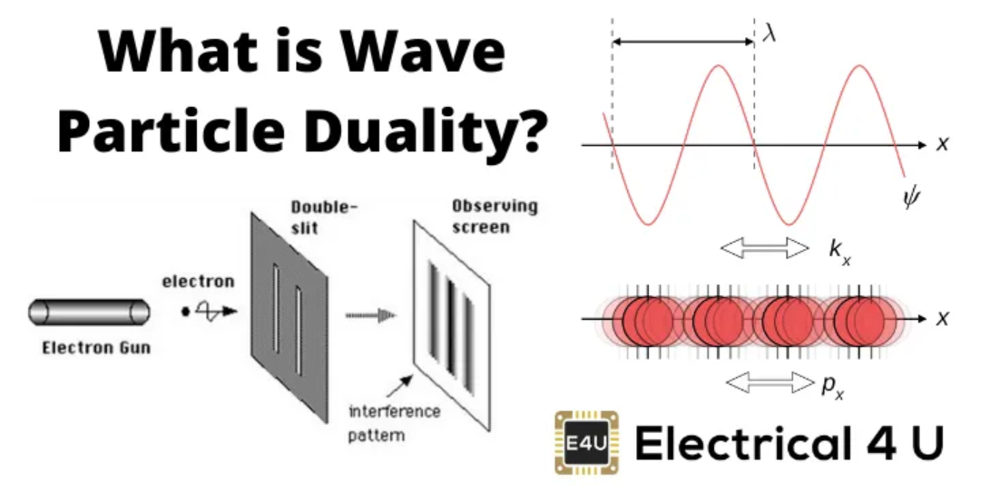](https://www.electrical4u.com/wave-particle-duality/)

<i>Fig 4: Wave Particle Duality</i>

One of the most counterintuitive concepts in physics – the idea that quantum objects are complementary, behaving like waves in some situations and like particles in others.
   
These [particle waves](http://electron6.phys.utk.edu/phys250/modules/module%202/matter_waves.htm) are referred to as *matter waves*, [Luis de Broglie](https://www.spaceandmotion.com/Physics-Louis-de-Broglie.htm) first proposed that all a wave function is associated wit all particles. These matter waves are a central part of the theory of $Quantum$ $Mechanics$. The *wavelengths* ($\lambda$) of these particles can be calculated by the following equation has proposed by *de Broglie* , which is referred to as *de Broglie's* equation.

$$🧮de \ Broglie's \ Equation$$

$$\lambda =  \frac{h}{mv}$$

$$\lambda=wavelength \ matterwave$$ 

$$h=planck's \ constant$$ 

$$m = particle \ mass \ moving \ at \ velocity \ v$$

### **Measurement Problem**
[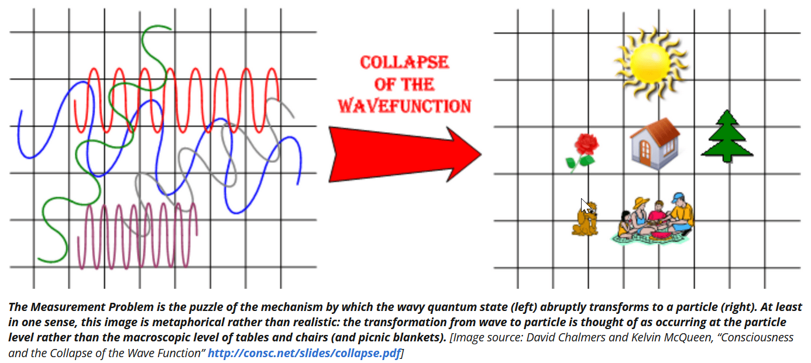](http://www.quantumphysicslady.org/glossary/measurement-problem/)

<i>Fig 5: QP Measurement Problem</i>

According to the [Copenhagen Interpretation](https://physicsworld.com/a/thirty-years-of-against-measurement/) (being debated), which states that [during measurement](https://plato.stanford.edu/entries/qm-copenhagen/), the observer gets a subjective perception of what is going on in the quantum space, which means that these particles exhibit the property of [*non-locality*](https://www.scientificamerican.com/article/how-einstein-revealed-the-universe-s-strange-nonlocality/). *Non-locality which basically means, no observed particles have an absolute location in space.* Sub atomic particles are expressed as [wave functions](https://www.quantumphysicslady.org/glossary/wave-function/) ($ \Psi $) ie., only an approxmation of its actual location can be done based on mathematical probabilities and the exact location of the particle is unknown.

The **Measurement Problem** states that these wave functions abruptly collapse into a particle in a point of space in time during observation, whose beahvior is unknown.

### **Superposition**

Superposition | Decoherence 
|:--:|:--:|
[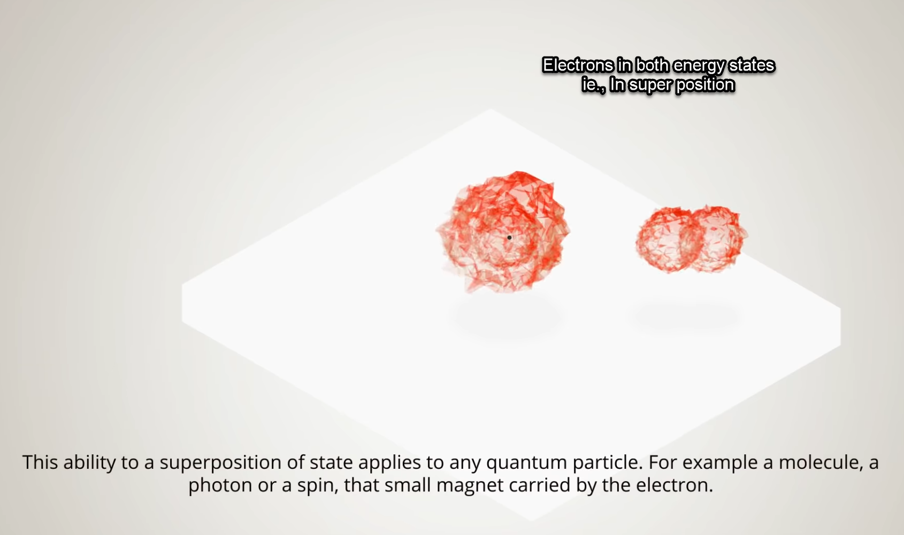](https://youtu.be/7B1llCxVdkE) | [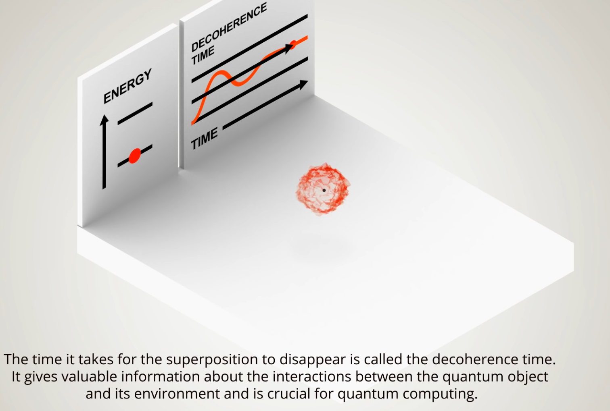](https://youtu.be/7B1llCxVdkE)

<i>Fig 6: Quantum Superposition & Decoherence</i>

*Superposition* or *Quantum Superposition* is defined as the ability of a sub atomic particle (such as an electron) to be in [multiple quantum states](https://jqi.umd.edu/glossary/quantum-superposition) all at the same time but when observed only has one state. In the case of an electron which gets excited (jumps to a higher energy state) in the presence of electro magnetic radiation (e.g Magnetic Field) exists in both a high energy state and a low energy state at the same time. This is deduced from the wave patterns during its observation. An important term to also know at this point is *decoherence* which is when superposition can no longer be measured.

[*Superposition Principle*](http://physics.gmu.edu/~dmaria/590%20Web%20Page/public_html/qm_topics/superposition/superposition.html)

This principle states that a system (such as a group of quantum particles) exist in all *possible states at the same time*, only after measurement it falls to one of the *states* that form the superposition. This destroys its original configuration

The superposition principle is the idea that a system is in all possible states at the same time, until it is measured. After measurement it then falls to one of the basis states that form the superposition, thus destroying the original configuration. The superposition principle explains the "quantum weirdness" observed with many experiments.

Superposition principle equation states that a *statefunction*($\Psi$) can be expanded as a linear combination of the normalized [*eigenstates*](https://web.physics.wustl.edu/alford/physics/essentials.pdf) ($\phi _{n}$) of a particular *operator* that constitute a basis of the space occupied by ($\Psi$). For the discrete case

$$🧮Superposition \ Principle \ - Discrete  \ Case$$

$$|\Psi\rangle=\sum_{n=1}^{\infty}|b_{n}\varphi_{n}\rangle$$

$$where \ the \ coefficients(b_{n}) = functions \ of \ time(t) and \ given  \ by : $$ 

$$ b_{n}=\langle\varphi_{n}|\Psi\rangle $$

$$ which \ is \ the  \ projetion  \ of (\Psi) \ onto \ the  \ \textbf{eigenvector}(\varphi_{n})$$

### [**Quantum State**](https://www2.ph.ed.ac.uk/~ldeldebb/docs/QM/lect1.pdf) 

Fundamental Law of Quantum Mechanics

$$🧮Quantum \ State \ Equation $$

$$ Quantum\ State\sim \Psi(x,t) $$

$$ \Psi\ = \ complex function $$

$$ x = coordinates $$

$$ t = time $$

Where the function $\Psi$ is the *complex function* which describes *wave-particle duality* (Fig 4) which depends on the coordinate($x$) and time($t$). This wave function indicates that the behavior of a quantum object is [probabilistic](https://quantumatlas.umd.edu/entry/quantum-states/), this means that the wave function encodes all the probabilistic outcomes of the measurement and this *quantum state* equation captures the full range of these possible measurement outcomes.   

<i>Fig 6.1: 3d Illustration of a wave function</i>

### **👻Entanglement** (also referred to as Spooky Action)

[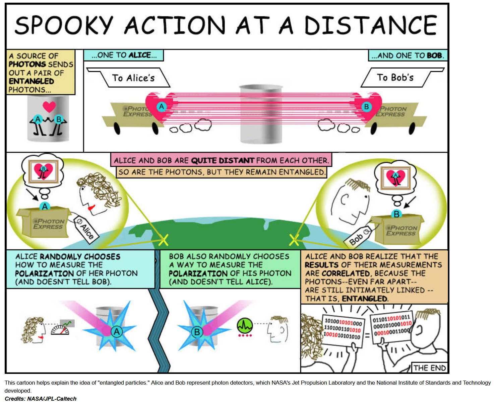](https://www.nasa.gov/feature/jpl/particles-in-love-quantum-mechanics-explored-in-new-study)

<i>Fig 7: Quantum Entanglement or Spooky Action</i>

In [Quantum Theory](https://blogs.scientificamerican.com/observations/what-does-quantum-theory-actually-tell-us-about-reality/),  [Quantum Entanglement is most bizzare and mysterious properties of quantum particles](https://www.livescience.com/what-is-quantum-entanglement.html), which states that two subatomic particles can be intimately linked to each other even if seperated by [billions of years light years in space](https://www.space.com/31933-quantum-entanglement-action-at-a-distance.html) ie., any change induced in one particle will affect the other. The mechanics of this behavior is unknown.

 These two particles share a common unified [quantum state](https://www2.ph.ed.ac.uk/~ldeldebb/docs/QM/lect1.pdf), such that any observation of one of these particles will provide information aboth the other entangled particles. And any action to one of these particles will invariably impact the others in the entangled system. 

### **Quantum Tunneling**   

[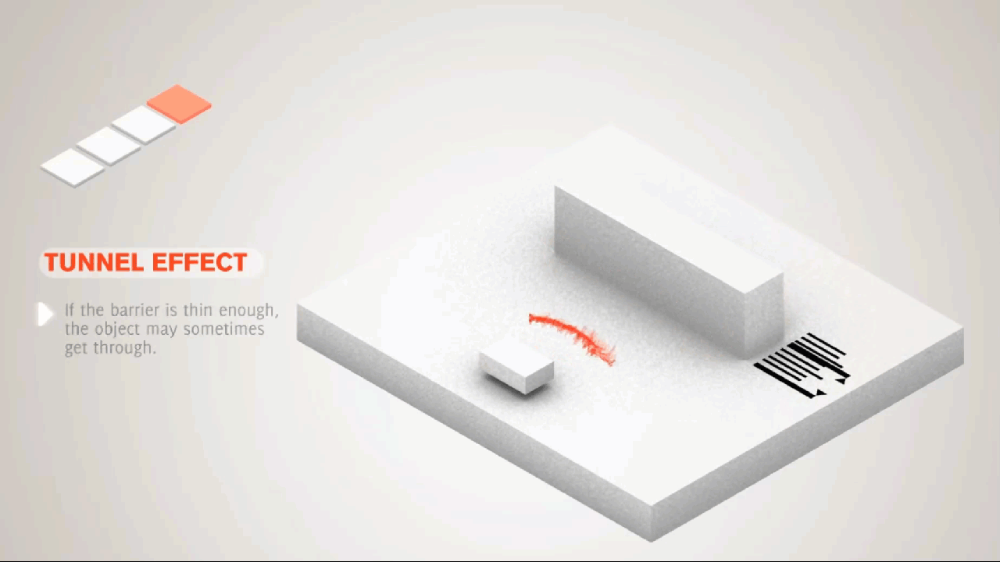](https://youtu.be/K64Tv2mK5h4)

<i>Fig 8: Quantum Tunneling</i>

[Quantum Tunnelling is a phenomenen](http://abyss.uoregon.edu/~js/glossary/quantum_tunneling.html) which has no counterpart in classical physics, it states that particles can [penetrate a potential energy barrier](https://opentextbc.ca/universityphysicsv3openstax/chapter/the-quantum-tunneling-of-particles-through-potential-barriers/) with a height greater than the total energy of particles. In simple terms quantum tunnelling is where an atom or a [subatomic particile can appear on the opposite of a barrier](https://www.livescience.com/quantum-tunneling-observed-and-measured.html) that should be impossible for the particle to penetrate. This is an important property in understanding [energy production models of the sun.](https://www.academia.edu/11446310/Quantum_tunnelling_in_the_sun) 

### **Heisenberg Uncertainity Principle**  

[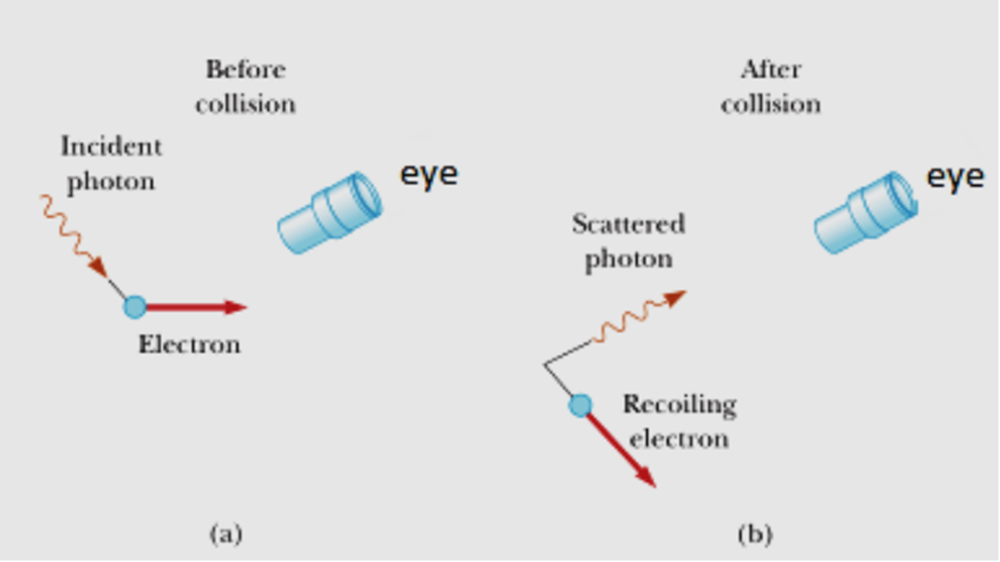](https://physicscatalyst.com/graduation/heisenberg-uncertainty-principle/)

<i>Fig 9: Light microscopy for measuring speed and momentum </i>

A principle of the quantum realm referring to the measurement of a particle. As we have discussed so far, that a sub atomic particle displays both a wave and particle like behavior, measuring both the *position* and *speed* becomes a challenge. The Heisenberg Uncertainity Principle states that it is [impossible to know exactly both the position & speed of a particle](https://scienceexchange.caltech.edu/topics/quantum-science-explained/uncertainty-principle). And the more effort is done to measure these properties, the less accurate the results. 

In order to see a particle, light has to reflect of the particle and enter our viewing appartus. But the problem occurs when the photons emitted from the device that tries to measure the particle, these photons(light) transfer energy (momentum) when striking the particle, change its momentum and speed. So this light when reflected of the particle enters the viewing apparatus is already carrying inaccurate and altered information. 

[The Heisenberg Uncertaining Principle](https://openstax.org/books/university-physics-volume-3/pages/7-2-the-heisenberg-uncertainty-principle) equation is the product of the *uncertainity in position*($\Delta x$) of a particle and the *uncertaining in its momentum*($\Delta p$) , which can never be less than one half ($< \frac{1}{2}$) of the planck constant($h$).

$$🧮Heisenberg \ Uncertainity \ Principle \ Equation $$

$$\Delta x . \Delta p \ge \frac{h}{2}$$

$$\Delta x=Change \ in \ position $$

$$\Delta p=Change \ in \ momentum $$

$$h=planck \ constant$$

### **Energy Quantization** 

[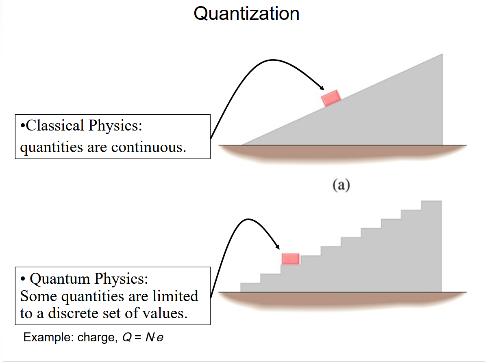](https://slideplayer.com/slide/10879856/)

<i>Fig 10: Quantization of energy </i>

[Energy is quantized in some systems](https://opentextbc.ca/openstaxcollegephysics/chapter/quantization-of-energy/), meaning that the system can have only certain energies and not a continuum of energies, unlike the classical case. This would be like having only certain speeds at which a car can travel because its kinetic energy can have only certain values. We also find that some forms of energy transfer take place with discrete lumps of energy. While most of us are familiar with the quantization of matter into lumps called atoms, molecules, and the like, we are less aware that energy, too, can be quantized. Some of the earliest clues about the necessity of quantum mechanics over classical physics came from the quantization of energy. 

[Max Planc](https://www.nobelprize.org/prizes/physics/1918/planck/biographical/) used that idea that atoms and molecules (quantum realm) act like oscillators to absorb and emit radiation. ie., the energy within these particles are not constant, but due to constant absorbtion and emission the energy is *quantized*. He is also credited for [discovering constant proprtionality](https://illuminating.science/what-is-plancks-constant/) which is instrumental in calculation of physical quantities in the quantum mechanics. This proptionality is referred to as the **planc's constant**.

Planc's postulate for the energy state ($E$ $_{n}$) of a quantum mechanical simple harmonic oscillator with the following equation

$$ 🧮 Planck's \ Postulate - Quantum \ Mechanical \ Simple \ Harmonic \ Oscillator  $$

$$ E_{n}=(n+\frac{1}{2})hv $$

$$ E_{n} = Energy \ State $$

$$ n = non-negative \ integer \ (1,2,3...) $$ 

$$ v = frequency \ of \ oscillations $$

$$ h(planc's \ constant) = 6.62610^{-34}J.s $$

> 🍌 TLDR - The above are the most basic building blocks of Quantum Physics. These properties are exploited in Quantum Computing

## Standard Model of Particle Physics

The following diagram is an illustration of the [Standard Model](https://simple.wikipedia.org/wiki/Standard_Model) of elementary particles as described by the [particle theory in physics.](https://www.le.ac.uk/se/centres/sci/selfstudy/particle01.html)

[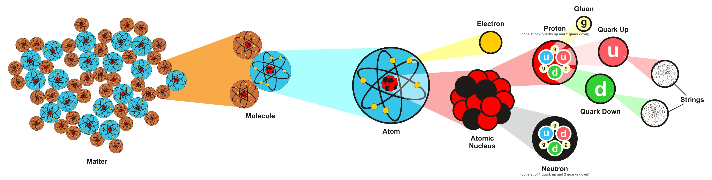](https://www.livescience.com/60900-tetraquark-particle-exists.html)

<i>Fig 11: Standard Model of Particle Physics - Brief </i>

<i>Fig 11.1: Standard Model of Particle Physics - Particles, Conservation Laws, Standard Model Interactions, Force Interactions </i>

[The Standard Model of Particle Physics](https://www.energy.gov/science/doe-explainsthe-standard-model-particle-physics) is scientists current best theory to describe the most basic building blocks of the universe. It explains how particles called quarks (which make up protons and neutrons) and leptons (which include electrons) make up all known matter. It also explains how force carrying particles, which belong to a broader group of bosons, influence the quarks and leptons. This standard model is represented by the [*Standard Model Equation*](https://www.symmetrymagazine.org/article/the-deconstructed-standard-model-equation)

<i>Fig 11.2: Brief explanation of the <u>Standard Model Equation</u> </i>

> 🍌 Every thing can be broken own into smaller units. The most commonly known unit is the *molecule*. *molecules* in turn are made of smaller particles, and so and so forth until we reach the limits of observation.

## Quantum Particles

All matter in the universe can be subdivided into two classes based on their *spin*.[There are two classes of quantum particles](https://www.sciencedirect.com/topics/mathematics/quantum-particle), those with a spin multiple of one-half, called fermions, and those with a spin multiple of one, called **bosons**. 

The spin quantum number of **fermions** can be ($s = +\frac{1}{2}$), ($s =-\frac{1}{2}$), or an odd multiple of ($s = ± \frac{1}{2}$). Electrons, protons, and neutrons are fermions. 

The spin quantum number of **bosons** can be ($s = +1$), ($s = −1$), ($s = 0$), or a multiple of ($w = ±1$).

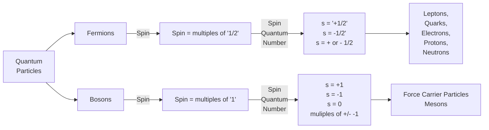

## [Quantum Mechanics](https://www.livescience.com/33816-quantum-mechanics-explanation.html) 

Defined as a sub field of physics that describes interaction between particles of the sub atomic realm. *Sub Atomic* referring to the particles that form the atoms, and those particles that form the atoms.

To Do Items 
- [ ] Describe hilbert space 
- [ ] Describe Schrodinger equation
- [ ] Describe principles of Quantum Mecahnics 
- [ ] Talks about EigenStates

### Wave Functions

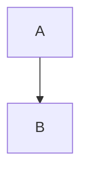

# 🐱‍💻 Quantum Computing (Finally 🙃)

Now that we have a firm grasp (😁) of the important fundamental of QC, the following are a curated sources for some experimentation

# 🔎 References

Majority of the references will be 

1. [Header Quantum Entanglement Gif](https://tenor.com/view/entanglement-quantum-entanglement-science-atoms-gif-17770432) - Actual source of image is not described. The illustration is factual as described [HERE.](https://www.livescience.com/what-is-quantum-entanglement.html)

# 📒 GLOSSARY 

n | Term | Expansion
|:--|:--:|:--|
1 | QC | Quantum Computing 
2 | QP | Quantum Physics 
3 | QP | Quantum Mechanics
4 | SMP | Standard Model of Particle Physics